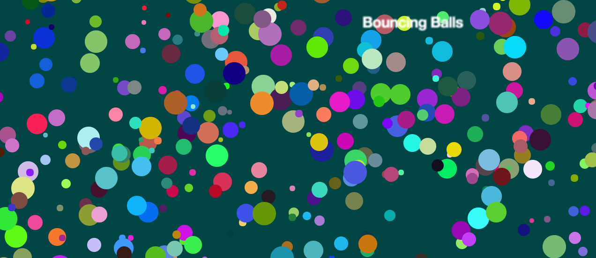

# Bouncing Balls 
Mozilla Developer Network (MDN) created a Object building practice tutorial to make learning fun. I got to recreate bouncing balls while learning Object-Oriented-Programming (OOP). 

This tutorial was done as a guided group activity and it took about four hours. 

* [MDN Tutorial](https://developer.mozilla.org/en-US/docs/Learn/JavaScript/Objects/Object_building_practice)

## What I learned
I learned that all the basic tools I've seen in the past can suddently be more complex yet they can do all sorts of fun things, too! 
It was fun and easy to follow along the MDN tutorial. ALtering the colors, sizes and speed of the balls was very entertaining!

### ScreenShot :computer: :camera:

